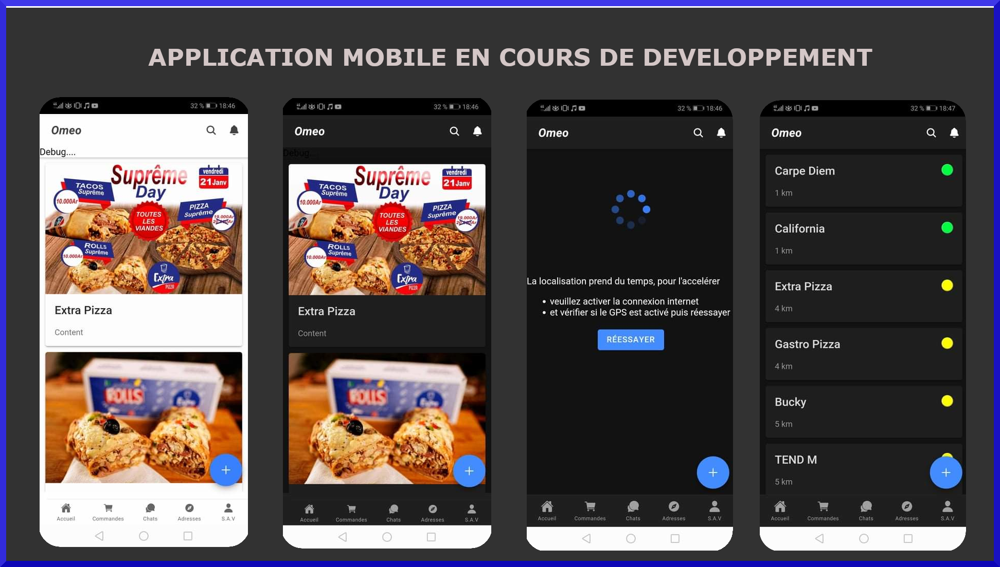
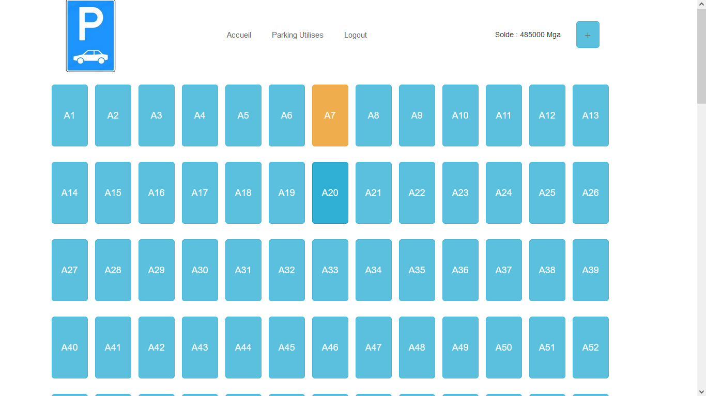
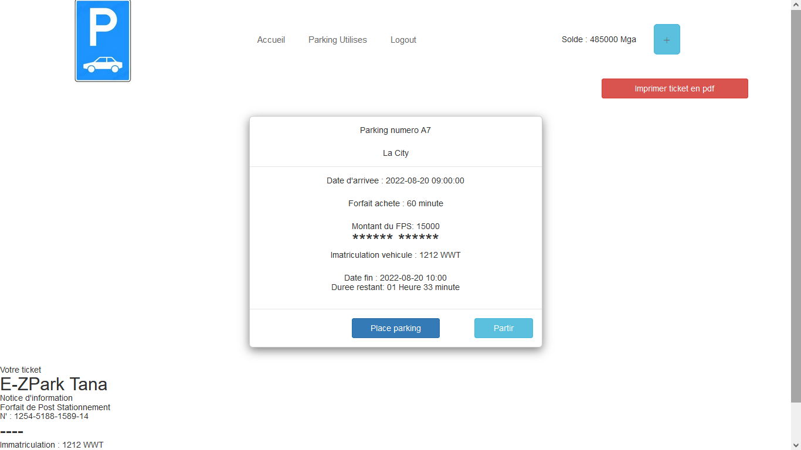

<!DOCTYPE html>
<html lang="fr">
<head>
    <meta charset="UTF-8">
    <meta name="viewport" content="width=device-width, initial-scale=1.0">
    <title>Portfolio - DreamTeam Dev</title>
    
    
</head>
<body>

<header>
    <h1>DreamTeam dev</h1>
    
Développeur Full Stack passionné par le développement d'applications web et mobiles

</header>

<nav>
    <a href="#about">À Propos</a>
    <a href="#projects">Projets</a>
    <a href="#skills">Compétences</a>
    <a href="#contact">Contact</a>
</nav>

    <section id="about" class="section">
        <h2>À Propos</h2>
        
Développeur Full Stack avec plus de 3 ans d'expérience dans la conception, le développement et la maintenance d'applications web et mobiles. Passionné par la résolution de problèmes complexes et l'optimisation des performances.

    </section>

    <section id="projects" class="section">
        <h2>Projets</h2>
        

            <h3>Système de Gestion de Bourses</h3>
            
Conception d'une application pour la gestion des bourses d'études, incluant des fonctionnalités d'inscription, de gestion des demandes et d'intégration bancaire.

            <small>Projet réalisé chez CAPDATA Software</small>
        

        

            <h3>Tableau de Bord Comptable</h3>
            
Développement d'un tableau de bord React pour la gestion financière, avec calcul automatisé des budgets et suivi des échéances.

            <small>Projet réalisé chez SCRIPTURA</small>
        

        

            <h3>Site Web d'Entreprise</h3>
            
Création et maintenance du site web de Scriptura, intégrant des outils SEO, des systèmes de suivi de trafic et un chat interactif.

            <small>Projet réalisé chez SCRIPTURA</small>
        

    </section>

    <section id="achievements" class="section">
        <h2>Réalisations</h2>
		

			
			

				<h3>Application mobile pour fast-food</h3>
				
Implémentation d'une Application mobile avec géolocalisation.

			

		

		

            &times;
            
        

		

			
			

				<h3>Plateforme pour réservation de Parking</h3>
				
Page d'accueil pour la réservation.

			

		

		

            &times;
            
        

		

			
			

				<h3>Plateforme pour réservation de Parking</h3>
				
Champ de saisie pour réserver une place avec payement.

			

		

		

            &times;
            
        

    </section>
	
	
	
    <section id="skills" class="section">
        <h2>Compétences</h2>
        

            
Java

            
C#/.NET

            
JavaScript (React, Angular, Node.js)

            
PHP (CodeIgniter, Symfony)

            
Python

            
HTML5 & CSS3

            
Bases de Données (PostgreSQL, MySQL, MongoDB)

            
Outils (Git, Visual Studio Code, MySQL Workbench)

        

    </section>

    <section id="contact" class="section">
        <h2>Contact</h2>
        
Email : <a href="mailto:dreamteamdvs@gmail.com">dreamteamdvs@gmail.com</a>

        
Téléphone : <a href="tel:+261347452459">+261 34 74 524 59</a>

        
Adresse : Antananarivo Madagascar

    </section>

<footer>
    &copy; 2024 DreamTeam Dev. Tous droits réservés.
</footer>

</body>
</html>